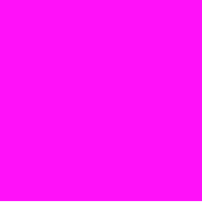
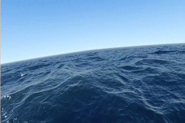

## CPUとGPU
&emsp;Shaderを理解するためには、CPUとGPUの違いについて知る必要があります。なぜならShaderはGPUに直接命令する言語だからです。普段皆さんが使っているDartやJavaScriptといった一般的な言語は、CPUに命令をします。\
&emsp;GPUは主に画面の描画に必要な演算処理を行うために使われます。GPUで全てのピクセルの色を何色にするかを決定することで、今見ている画面が描画されています。CPUは計算が非常に速いですが、数が少ないです。それに対してGPUは計算が遅いですが、沢山あります。\
&emsp;もしCPUで画面を描画しようとすると、全てのピクセルの色を1つのCPUで計算することになり、膨大な数の計算が必要になります。スマホやPCの画面を滑らかに描写することは不可能です。GPUの場合沢山あるため、それらが同時に計算を行なうことで、1つのGPUで行う処理を非常に少なくすることができます。それにより、スマホやPCの画面であろうと滑らかに描画することが出来ます。CPUとGPUでの描画のイメージは[こちらの動画](https://www.youtube.com/watch?v=-P28LKWTzrI)が非常に分かりやすいのでぜひご覧ください。

## Shaderとは？
&emsp;Shaderで行うことは1つのピクセルの色を何色にするかということだけです。下記のコードを見てください。
```
void main() {
	gl_FragColor = vec4(1.0,0.0,1.0,1.0);
}
```

&emsp;こちらは世界的に有名なShaderの本「[The Book of Shaders](https://thebookofshaders.com/)」で書かれているHelloWorldです。実行するとピンク色の四角形が表示されます。

<div align="center">
    
</div>

Shaderで文字を表示しようとすると大変なので、代わりに色がついた四角形を表示しています。コードを見ると、`gl_FragColor`という変数にvec4型を代入しています。この`gl_FragColor`がピクセルの色を何色で描くかを決定するものになります。vec4は色のRGBAを表します。色は16進数や0~255の値で指定することが多いですが、Shaderの場合は0~255の値を255で割って0~1に正規化した値を使います。つまり`vec4(1.0,0.0,1.0,1.0)`はピンク色を表します。\
&emsp;以上からこのコードは全てのピクセルに対して、ピンク色を指定しているため、ピンク色の四角形が表示されたのです。

## FlutterにおけるShader
&emsp;ShaderにはVertexShaderとFragmentShaderがあります。VertexShaderを実行したのち、FragmentShaderを実行するという順番で行われます。VertexShaderでは描画するものの頂点を決めます。これにより描画するキャンバスの形が決定します。FragmentShaderではVertexShaderで決定したキャンバスの内側のピクセルの色を何色にするかを決定します。\
&emsp;しかしFlutterではVertexShaderはサポートされていません。FragmentShaderのみ指定することができます。このことについては[こちらのFlutter公式ドキュメント](https://docs.flutter.dev/ui/design/graphics/fragment-shaders#authoring-shaders)に記述されています。\
&emsp;FragmentShaderだけでも綺麗なグラフィックを描くことは可能です。こちらの画像をご覧ください。

<div align="center">
    
</div>

こちらはShaderの投稿サイト[Shadertoy](https://www.shadertoy.com/)に投稿された作品「[Seascape](https://www.shadertoy.com/view/Ms2SD1)」です。ShadertoyではVertexShaderはありません。決まった長方形のキャンバスの中にFragmentShaderで描きます。FragmentShaderだけでもこれだけのグラフィックが描けるのです。\
&emsp;しかし「[Seascape](https://www.shadertoy.com/view/Ms2SD1)」のコードを見て頂けると分かると思いますが、コードがとても難しいです。綺麗なグラフィックを描くためには数学の知識が必要になってきます。そしてその難易度は、VertexShaderを使った場合より、FragmentShaderのみを使う場合の方が難しいです。なのでVertexShaderをサポートしていないFlutterでShaderを使うのは難しいです。\
&emsp;しかし抜け道はあります。画像です。画像とFragmentShaderとの相性は抜群にいいです。画像は四角形でできています。なので四角形のキャンバスしかなくても、画像であれば自然にキャンバスに埋め込むことができます。またFragmentShaderでは1ピクセルごとの色を指定します。このことから画像の1ピクセルごとの色を使って、簡単に効果の掛かった画像を描画することができます。

## Shaderを使って画像を表示する
&emsp;ではまず、単純に画像を表示することから始めます。`shaders/show_image.frag`ファイルと`assets/dash.jpg`を用意し、`pubspec.yaml`に下記のように記述します。
```
flutter:
  assets:
    - assets/
  shaders:
    - shaders/show_image.frag
```

**shaders/show_image.frag**
```
#include <flutter/runtime_effect.glsl>

out vec4 fragColor;
uniform vec2 uSize;
uniform sampler2D uTexture;

void main() {
    vec2 uv = FlutterFragCoord().xy / uSize;
    fragColor = texture(uTexture, uv.xy).rgba;
}
```
&emsp;`out`は出力する変数を表すキーワードです。ピクセルの色を何色にするかを決定するため、vec4型を出力します。\
&emsp;`uniform`はCPUから渡される変数を表すキーワードです。後でDartでShaderに渡す処理を書きます。uSizeのuは`uniform`を表します。Shaderではuniformをuから始まる変数で宣言することが多いです。Flutterの場合あまり関係がありませんが、VertexShaderを使った場合、VertexShaderから渡される変数はvから始まるものにして、どこから渡されたものか区別しやすくしたりします。\
&emsp;`FlutterFragCoord()`は描画するピクセルの(x,y)座標を取得します。0からキャンバスの縦横の幅までの値が入ります。`flutter/runtime_effect.glsl`ライブラリで宣言されているメソッドの為、`#include <flutter/runtime_effect.glsl>`でライブラリをインポートする必要があります。\
&emsp;`uSize`はキャンバスのサイズを表します。`FlutterFragCoord().xy`を割ることで(x,y)の座標の値を0~1の正規化した値に変換することができます。\
&emsp;`uTexture`は画像を表します。`texture(uTexture, uv.xy).rgba`で画像の指定した座標の位置の色を取得します。この時座標は0~1の値のものでないといけないため、uvを使っています。ここで取得した色を`fragColor`に代入することで、色を出力します。この処理を全てのピクセルで同時に行われることで画像が描画されます。